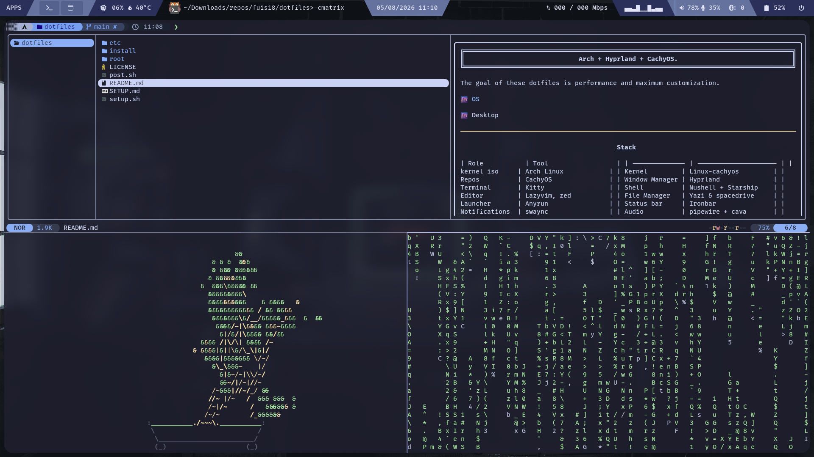

# Arch + Hyprland + CachyOS.

The goal of these dotfiles is maximum performance and greatest customization.

[](https://archlinux.org)
[](https://hyprland.org)
[](https://cachyos.org)



---

## Stack

### Core

| Role           | Tool                |
| -------------- | ------------------- |
| kernel iso     | Arch Linux          |
| Kernel         | Linux-cachyos       |
| Repos          | CachyOS             |
| Window Manager | Hyprland            |
| Network        | iwd + Knot Resolver |
| Launcher       | Anyrun              |
| Status bar     | Ironbar             |
| Notifications  | swaync              |
| Login Manager  | greetd + regreet    |
| Power menu     | wlogout             |

### TUIs

| Role           | Tool     |
| -------------- | -------- |
| Terminal       | Kitty    |
|                | Starship |
| Shell 1        | Nushell  |
| Shell 2        | zsh      |
| Editor         | Lazyvim  |
| File Manager 1 | Yazi     |
| Music          | ncmpcpp  |
| Bluetooth      | bluetui  |

### GUIs

| Role           | Tool           |
| -------------- | -------------- |
| File Manager 1 | Nautilus       |
| File Manager 2 | spacedrive     |
| Editor         | zed editor     |
| Browser 1      | Helium Browser |
| Browser 2      | Zen Browser    |

---

## Install

### Connect to the network

```sh
sudo systemctl enable --now iwd
iwctl station wlan0 connect "SSID"
```

### Clone and run

```sh
sudo pacman -S git

git clone https://github.com/fuis18/dotfiles.git

sudo cp -r dotfiles/etc/. /etc/
sudo chmod +x /etc/greetd/start-greeter
```

Edit /etc/knot-resolver/config.yaml for your dns

```sh
sudo bash dotfiles/setup.sh
sudo zsh dotfiles/post.sh
```

> For full disk partitioning and bootloader setup, see [SETUP.md](./SETUP.md).

## TODO

- Ironbar to AGS
- Arch to Artix (dinit)
- config niri
