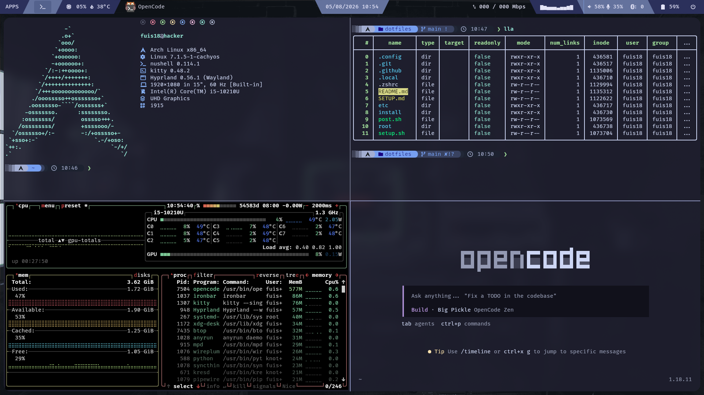
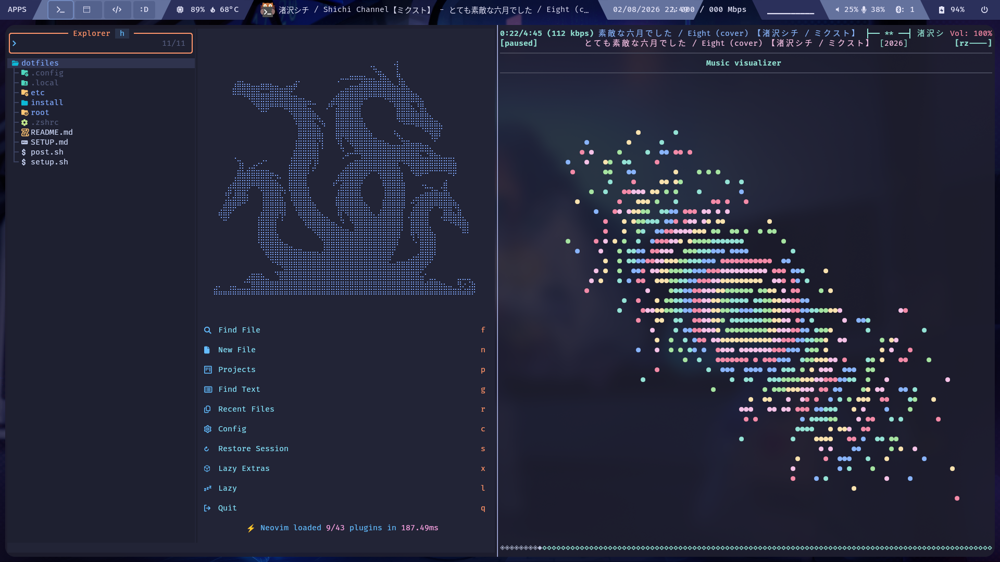

# Arch + Hyprland + CachyOS.

The goal of these dotfiles is performance and maximum customization.

[](https://archlinux.org)
[](https://hyprland.org)
[](https://cachyos.org)




---

## Stack

| Role           | Tool                  |
| -------------- | --------------------- |
| kernel iso     | Arch Linux            |
| Kernel         | Linux-cachyos         |
| Repos          | CachyOS               |
| Window Manager | Hyprland              |
| Terminal       | Kitty                 |
| Shell          | Nushell + Starship    |
| Editor         | Lazyvim, zed          |
| File Manager   | Yazi & spacedrive     |
| Launcher       | Anyrun                |
| Status bar     | Ironbar               |
| Notifications  | swaync                |
| Audio          | pipewire + cava       |
| Bluetooth      | bluez + bluetui       |
| Network        | iwd + Knot Resolver   |
| Screenshot     | grim + slurp + swappy |
| Brightness     | brightnessctl         |
| Login Manager  | greetd + regreet      |
| Power menu     | wlogout               |

---

## Install

### Connect to the network

```sh
sudo systemctl enable --now iwd
iwctl station wlan0 connect "SSID"
```

### Clone and run

```sh
sudo pacman -S git

git clone https://github.com/fuis18/dotfiles.git

sudo cp -r dotfiles/etc/. /etc/
sudo chmod +x /etc/greetd/start-greeter
```

Edit /etc/knot-resolver/config.yaml for your dns

```sh
sudo bash dotfiles/setup.sh
sudo zsh dotfiles/post.sh
```

> For full disk partitioning and bootloader setup, see [SETUP.md](./SETUP.md).

## TODO

- Ironbar to AGS
- Arch to Artix (dinit)
- config niri
